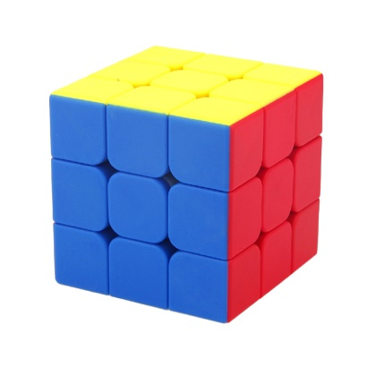
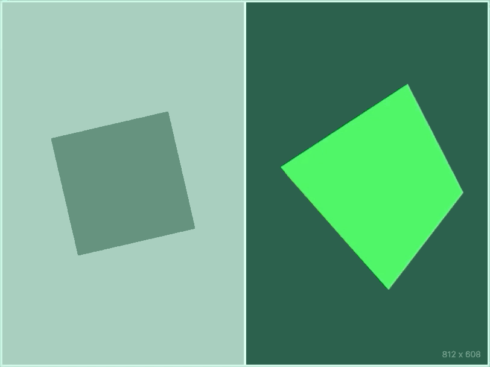

# Tugas 1
Anda wajib menggunakan repositori ini sebagai titik mula pengerjaan tugas.
Jangan lupa untuk mengganti nama pada judul halaman HTML yang tersedia dengan NRP Anda.

## Detail Penugasan
1. Gantilah foto obyek yang ada di halaman README ini dengan foto obyek yang telah Anda peroleh di tugas sebelumnya.
2. Buatlah aplikasi WebGL layar penuh (_fullscreen_).
3. Isi kanvas sebelah kiri dengan gambar 2-dimensi dari obyek yang telah Anda foto sebelumnya.
4. Putar gambar tersebut searah jarum jam (_clock wise_) jika NRP Anda ganjil, putar gambar tersebut berlawanan arah jarum jam (_counter clock wise_) jika NRP Anda genap. Gunakan kecepatan putar `0.5°` _per frame_.
5. Isi kanvas sebelah kanan dengan gambar 3-dimensi dari obyek yang telah Anda foto sebelumnya.
6. Putar gambar tersebut terhadap sumbu X dengan kecepatan putar `0.25°` _per frame_, dan putar gambar tersebut terhadap sumbu Y dengan kecepatan putar `0.75°` _per frame_.
7. Aplikasikan proyeksi perspektif pada kanvas sebelah kanan dengan `field of view = 60°`, `near clip distace = 1`, dan `far clip distance = 50`. Agar kubus tidak tampak terpotong (_clipped_), translasikan dia sebesar `1.5 unit` menjauhi kamera.
8. Gantilah animasi (GIF) yang ada di halaman README ini dengan animasi (GIF) hasil akhir aplikasi WebGL Anda.

## Foto Obyek

## Animasi (GIF) Aplikasi WebGL

## Referensi
- [Learning WebGL on Github](https://github.com/davidwparker/programmingtil-webgl)
- [Learning WebGL on Youtube](https://www.youtube.com/watch?v=oDiSqQT_szo&list=PLPqKsyEGhUnaOdIFLKvdkXAQWD4DoXnFl)
- [WebGL API](https://developer.mozilla.org/en-US/docs/Web/API/WebGL_API/WebGL_model_view_projection)
